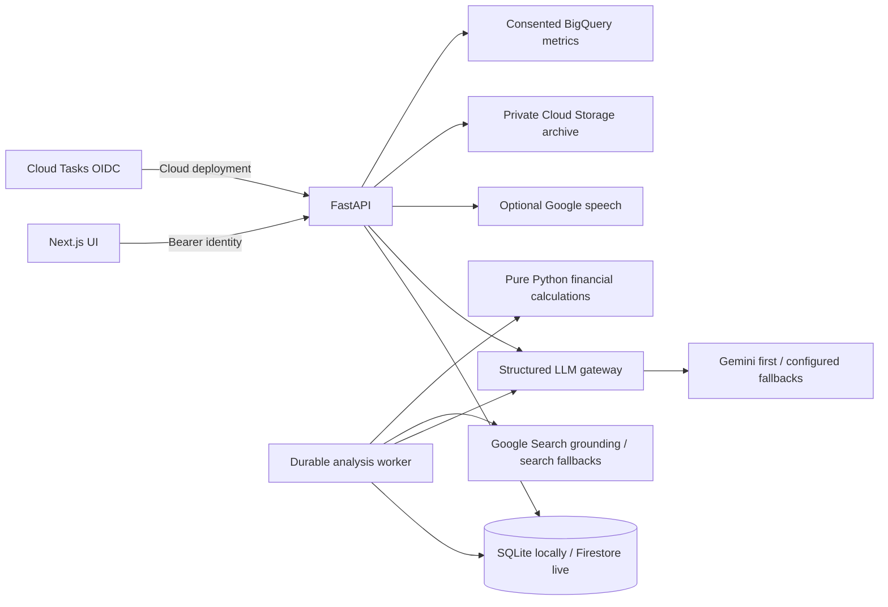

# Architecture and trust boundaries

The frontend's browser API URL is compiled at build time; Firebase web settings are fetched from the backend at runtime. Docker binds the two exposed ports to loopback. Native launchers bind API and development frontend to loopback; the production Next.js process listens on its service interface, so use the host firewall appropriately.

## Storage and work

Each product record is keyed by owner, kind and opaque ID. Sections are split into their own collection per analysis to respect Firestore document size limits. SQLite uses WAL, transactions and leased locks; Firestore uses transactions for claims and writes. Cloud jobs and local polling claim the same durable job, preventing duplicate concurrent execution. Attempts are bounded and an exhausted lease becomes a visible failed report rather than spinning forever.

The seven analysis stages save actual progress and elapsed durations. Stage failure preserves sections. Refreshing research produces a new version; changing assumptions previews pure calculations and can save a separate version with zero new model calls. A section refresh recomputes its dependent report in a new version to preserve consistency. No original version is overwritten by a scenario preview.

## Evidence and calculations

Research receives founder-approved generic terms. Model-proposed terms never override that consent. Sources are code-assigned, deduplicated and HTTPS-filtered; the server does not fetch arbitrary supplied pages. Source extraction requires a literal quote in the provided excerpt and validates numeric tokens against that quote. An assumption labelled sourced additionally needs matching units, geography and a year within the last three calendar years. Currency units are canonical and no exchange conversion is inferred.

These checks establish linkage to an excerpt, not independent truth. Search snippets can be incomplete, and a model can still misunderstand their meaning. The Sources screen and raw export let a reviewer inspect the basis. Unsupported top-down market numbers are unavailable. Competitor positioning, wedge strength, moats and risk scores are subjective coaching judgments.

Market estimates expose top-down fractions separately from reachable accounts × monthly ARPU × 12. Revenue applies acquisition, churn, price, expansion, gross margin, CAC and fixed costs with a target-account ceiling. Cost/churn direction reverses in optimistic scenarios. Zero CAC or zero profit yields unavailable ratios/payback, never infinity. All input numbers must be finite and bounded.

Monte Carlo uses 1,000 independent triangular samples and seed 7. Its p10/p50/p90 describe the chosen model, not calibrated chances of business success. Sensitivity varies one assumption at a time. Funding need is peak cumulative cash deficit; initial cash, taxes, working capital, discounting and financing are excluded. INR defaults are an arbitrary illustrative scale, not a real FX quote.

## Models and false-positive control

All conversational calls go through one async gateway. It has per-call and total deadlines, provider cooldowns, schema validation, one JSON repair, optional-parameter retry and a visible fast-tier fallback. Demo mode does not call the gateway. Public assessments and actual timing/token fields are shown; hidden chain-of-thought is discarded, and missing provider token counts remain missing.

Four persona IDs must occur exactly once. Interest changes are clamped to 15 points per answer. Flags need a literal founder quote and at least 0.8 confidence. Missing numbers are flagged only when quantities were requested; honest unknowns and negated demo claims are guarded. Scores are practice judgments, not investment probability. Rewrites and suggested answers are checked for unsupported numbers; a safe coaching template replaces rejected numeric material. A rejected evidence quote is visibly marked for manual review.

## Privacy and security

Demo identities use a persistent HMAC secret and seven-day browser token. Live identities use Firebase verification with revocation checking; anonymous accounts can link Google sign-in. CORS allows explicit origins only. Authenticated APIs enforce tenant ownership. Browser rendering escapes model text; search suggestion HTML runs in a sandboxed iframe. Nonce CSP disallows arbitrary scripts, while inline styles support charts and animated UI. Body limits apply to streamed requests as well as Content-Length.

Share tokens are high-entropy and only hashes are stored. Public responses contain the title, safe context and selected sections; private pitch text and owner identity are absent. Shares expire and can be revoked. Review selections because chosen sections can contain business details. CSV fields neutralize spreadsheet formulas.

Workspace deletion writes a hashed tombstone so an in-flight worker cannot recreate private records. Cloud archives and opted-in telemetry are removed before local deletion when configured; unavailable cloud deletion returns a retryable error. Recent BigQuery streaming rows may temporarily resist DML deletion; retry after the streaming buffer clears. Old database records are purged by the local worker; cloud installations need the maintenance job plus bucket/dataset retention policies.

Cohort analytics require consent, five distinct real participants and ten real sessions. Members receive aggregates, never another founder's pitch or report. Demo and seed sessions are excluded. No global investment benchmark is fabricated.

Rate limits in this build are process-local, and the configured cloud recipe deliberately bounds instances. A high-traffic deployment should add gateway/distributed quota enforcement and load testing. Live Firestore, Google APIs and identity flows still require credentialed acceptance; mocks and SQLite tests cannot establish their production correctness.
